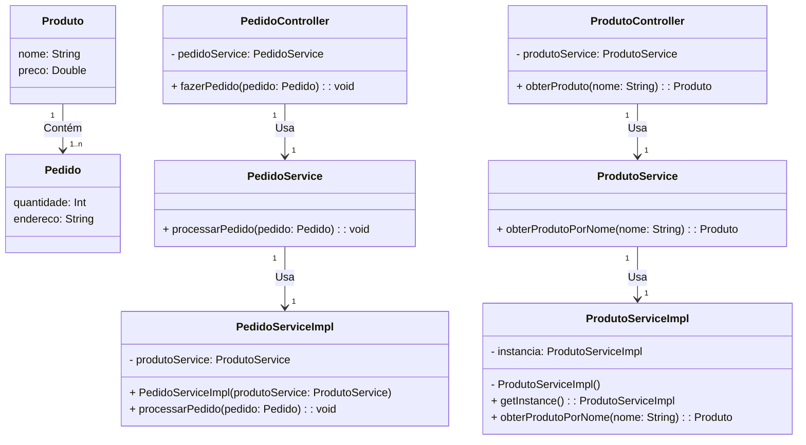

# Sistema Online de Pedidos

Este é um projeto de exemplo para um Sistema Online de Pedidos desenvolvido em Java com o auxílio do Maven. O sistema implementa padrões de projeto como Singleton, Facade e Strategy para uma arquitetura mais robusta e flexível.

## Funcionalidades

- **Cadastrar Produto:** Adicione produtos ao sistema com nome e preço.
- **Fazer Pedido:** Crie pedidos associados a um produto e uma quantidade, especificando também o endereço de entrega.

## Tecnologias Utilizadas

- Java
- Maven

### Diagrama de classe
